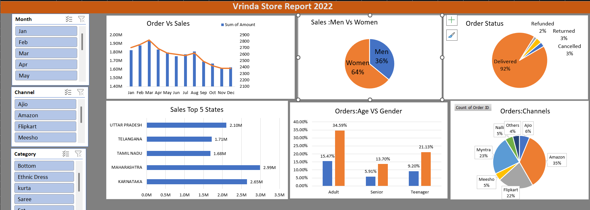

# Vrinda Store Data Analysis & Dashboard (2022)

## 📊 Dashboard Preview

## 📌 Overview
Yeh project Vrinda Store ke 2022 sales data ka Excel/Power BI dashboard hai. Isse sales trends, top states, gender distribution, aur channels ka analysis milta hai.

## 📈 Key Insights
- **Sales vs Orders:** Monthly sales trends aur total order count.
- **Top States:** Maharashtra aur Karnataka highest revenue generate karte hain.
- **Demographics:** Women (~64%) aur Adults (~34.5%) maximum orders place karte hain.
- **Top Channels:** Amazon (~35%) aur Myntra (~23%) sabse bade sales channels hain.

## 📁 Files Included
- `Vrinda_Store_Report.xlsx`: Interactive Dashboard & Raw Data.
- `dashboard_preview.png`: Dashboard ka Screenshot.
